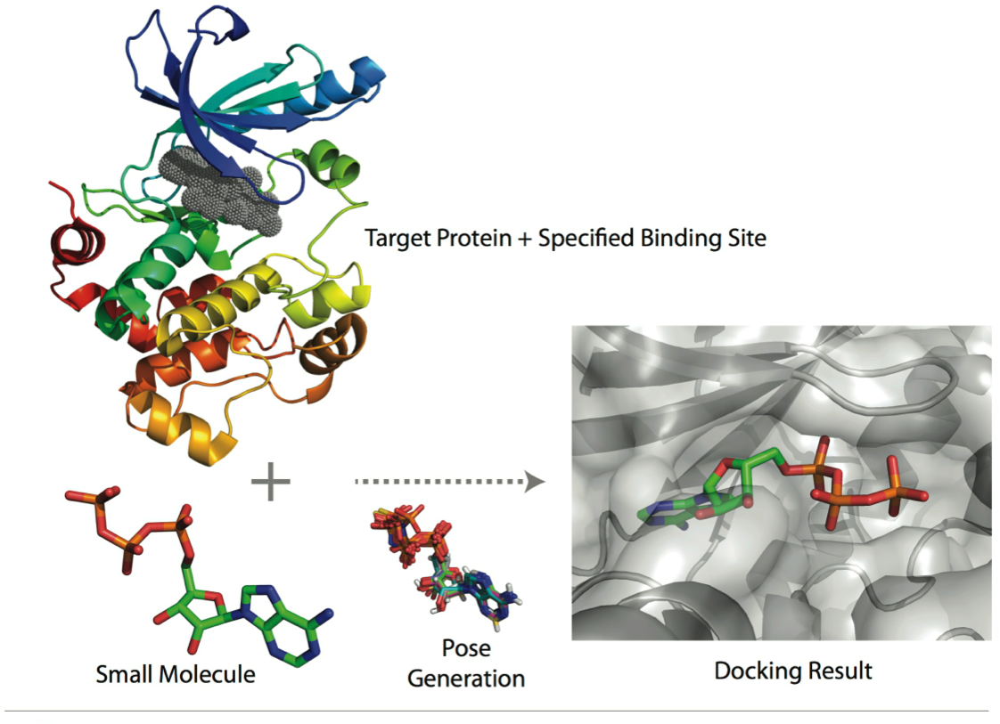
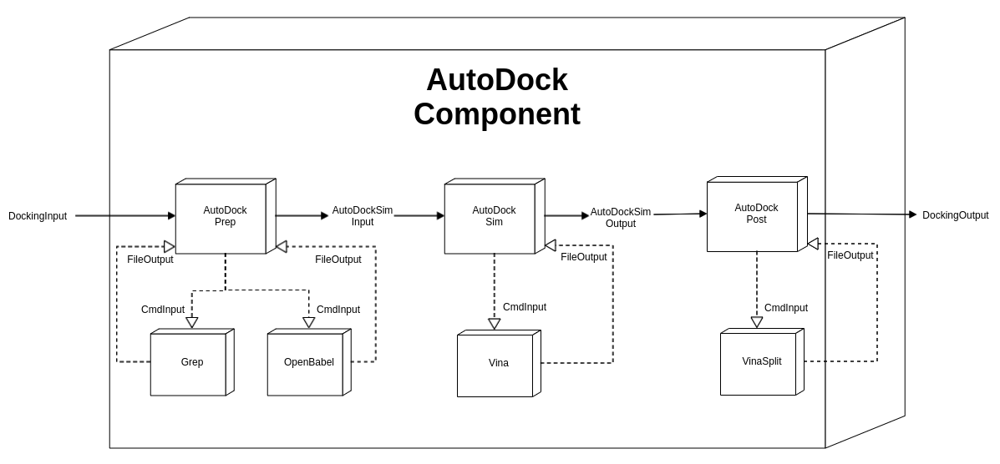

# What is Docking?
Docking is a computational technique used to determine the optimal binding modes of a ligand-receptor system. A ligand is typically a small (e.g. drug) molecule that binds to a macromolecular receptor such as a protein. A docking simulation estimates the strength of the binding (or a quantitative "score") in the vicinity of the receptor's binding site. Each score corresponds to the 3D conformation and orientation (or "pose") of the ligand relative to the receptor.

<p align="center">

</p>
    
Applications of docking include:

- Virtual screening (hit identification)
- Drug discovery (lead optimization)
- Binding site identification (blind docking)
- Protein-protein interactions
- Enzymatic reaction mechanisms
- Protein engineering

# Docking Component
## Preparing Input

<p align="center">

</p>

```python
# Import converter component for autodock vina
from components.implementation.docking.autodock_convert_component import ConvertAutoDockComponent

# Import docking data model
from models.components.docking.input import DockingRawInput

# Read raw docking input
receptor_data   = smiles_code or smarts_code or pdb_file ...
ligand_data     = smiles_code or smarts_code or pdb_file ...
dock_raw_input  = DockingRawInput(ligand=ligand_data, receptor=receptor_data)

# Convert raw docking input to a docking data object
dock_input = ConvertAutoDockComponent.compute(dock_raw_input)
```

## Running Docking with AutoDock Vina component

<p align="center">

</p>

```python
# Import docking simulation component for autodock vina
from mmcomponents_docking.autodock.autodock_component import AutoDockComponent

# Run autodock vina
dock_output = AutoDockComponent.compute(dock_input)

# Extract output
scores, poses = dock_output.scores, dock_output.poses
```

### Copyright

Copyright (c) 2020, MolSSI


#### Acknowledgements

Project based on the
[Computational Molecular Science Python Cookiecutter](https://github.com/molssi/cookiecutter-cms) version 1.1.

#### Issues

- Factory components
- Debugging components
- Performance (I/O overhead)
- Read/write methods left to components?
