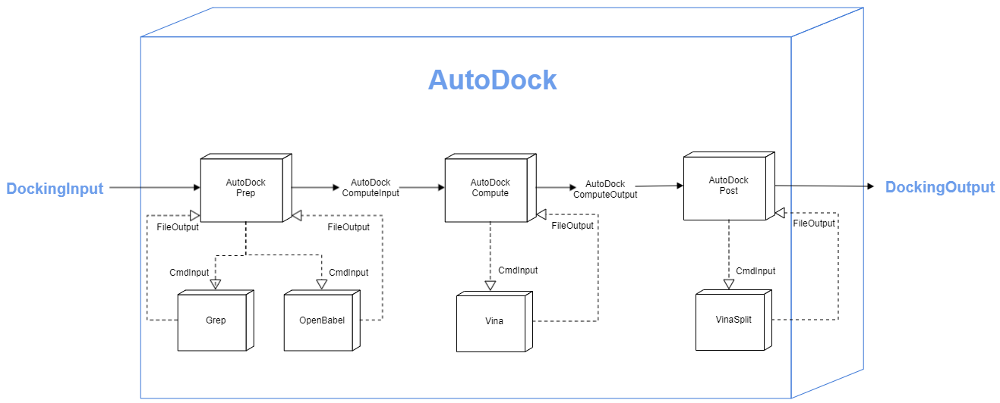

# What is Docking?
Docking is a computational technique used to determine the optimal binding modes of a ligand-receptor system. A ligand is typically a small (e.g. drug) molecule that binds to a macromolecular receptor such as a protein. A docking simulation estimates the strength of the binding (or a quantitative "score") in the vicinity of the receptor's binding site. Each score corresponds to the 3D conformation and orientation of the ligand relative to the receptor (or the "pose").

<p align="center">

</p>
    
Applications of docking include:

- Virtual screening (hit identification)
- Drug discovery (lead optimization)
- Binding site identification (blind docking)
- Protein-protein interactions
- Enzymatic reaction mechanisms
- Protein engineering

# Docking Component
## Preparing Input

```python
# Import MM molecule data model
from mmelemental.models.molecule import Molecule

# Construct MM molecules
receptor_data   = Molecule.from_file(pdb_file)
ligand_data     = Molecule.from_data(smiles_code)

# Import docking data model compliant with MMSchema
from mmelemental.models.app.docking import DockInput

# Construct docking input data from MMSchema molecules
dock_input = DockInput(ligand=ligand_data, receptor=receptor_data)

```

## Running Docking with AutoDock Vina component

<p align="center">

</p>

```python
# Import docking simulation component for autodock vina
from mmic_autodock.components.autodock_component import AutoDockComponent

# Run autodock vina
dock_output = AutoDockComponent.compute(dock_input)

# Extract output
scores, ligands = dock_output.scores, dock_output.ligands
```

### Copyright

Copyright (c) 2021, MolSSI


#### Acknowledgements

Project based on the
[Computational Molecular Science Python Cookiecutter](https://github.com/molssi/cookiecutter-cms) version 1.1.
