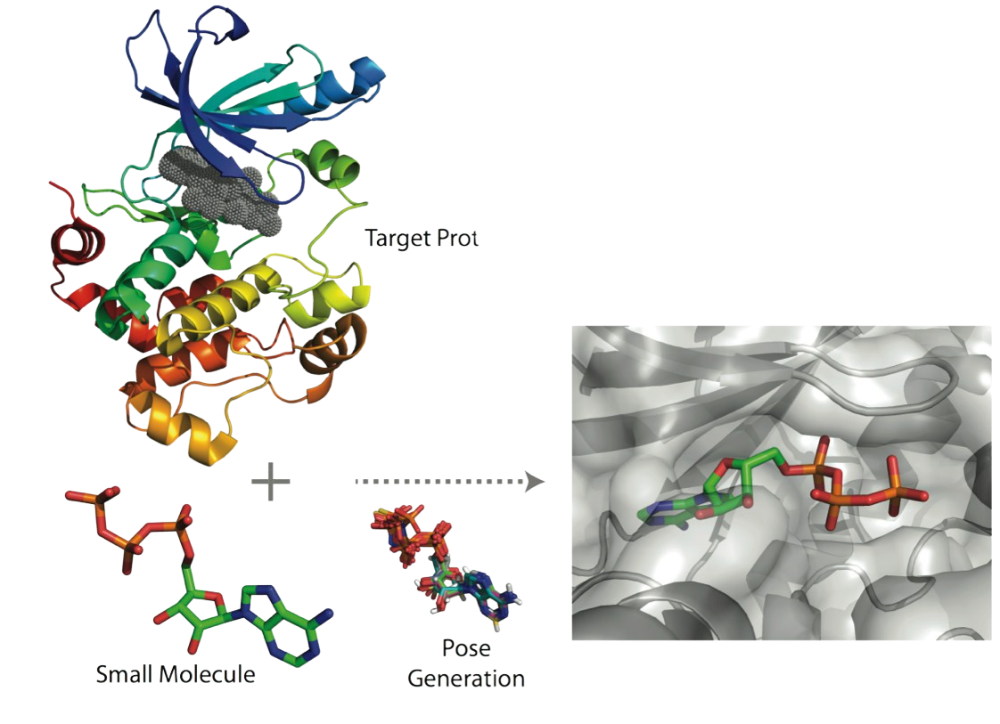

mmic_docking
============
[//]: # (Badges)
[](https://github.com/MolSSI/mmic_docking/actions?query=workflow%3ACI)
[](https://codecov.io/gh/MolSSI/mmic_docking/branch/master)
[](https://lgtm.com/projects/g/MolSSI/mmic_docking/context:python)

This is part of the [MolSSI](http://molssi.org) Molecular Mechanics Interoperable Components ([MMIC](https://github.com/MolSSI/mmic)) project. This package provides a code-agnostic or generic component and schemas for running molecular docking components.

# What is Docking?
Docking is a computational technique used to determine the optimal binding modes of a ligand-receptor system. A ligand is typically a small (e.g. drug) molecule that binds to a macromolecular receptor such as a protein. A docking simulation estimates the strength of the binding (or a quantitative "score") in the vicinity of the receptor's binding site. Each score corresponds to the 3D conformation and orientation of the ligand relative to the receptor (or the "pose").

<p align="center">

</p>
    
Applications of docking include:

- Virtual screening (hit identification)
- Drug discovery (lead optimization)
- Binding site identification (blind docking)
- Protein-protein interactions
- Enzymatic reaction mechanisms
- Protein engineering

# Docking Component
## Preparing Input

```python
# Import MM molecule data model
from mmelemental.models import Molecule

# Construct MM molecules
receptor = Molecule.from_file(pdb_file)
ligand   = Molecule.from_data(smiles_code, dtype="smiles")

# Construct docking input data from MMSchema molecules
dock_input = {
    "molecule": {
        "ligand": ligand, 
        "receptor": receptor
    }
    "search_space": (xmin, xmax, ymin, ymax, zmin, zmax),
    "search_space_units": "angstrom",
}
```

## Running Docking an engine component

```python
# Import docking simulation component for autodock vina
from mmic_docking.components import DockComponent

# Run autodock vina
dock_output = DockComponent.compute(dock_input)

# Extract output
scores, ligands = dock_output.observables.scores, dock_output.poses.ligand
```

### Copyright

Copyright (c) 2021, MolSSI


#### Acknowledgements

Project based on the
[Computational Molecular Science Python Cookiecutter](https://github.com/molssi/cookiecutter-cms) version 1.1.
